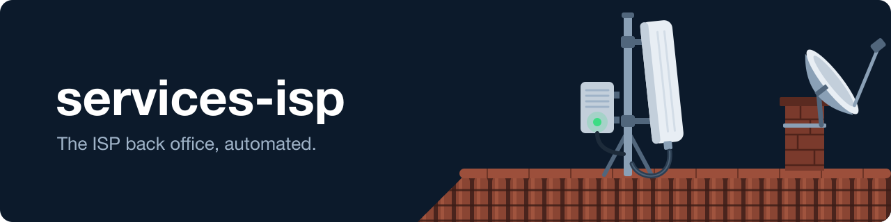

<p align="center">
  
</p>

<h1 align="center">services-isp</h1>

<p align="center">
  <a href="LICENSE"></a>
</p>

<p align="center">Task automation webapp for ISP operations</p>

---

An R/Shiny webapp that automates common tasks at an ISP.

It includes:

1) A client lookup: type a client number or name and get the CPE, antenna and traffic data in one screen.
2) An online checker that writes a PDF report to find faults in a client's connection. It connects to the antenna and the router and reads the traffic history. It has two tabs: a quick version and the full one.
3) An alarm for customers who went over their monthly quota, with a report every month.
4) Email signatures: it builds the simple HTML signature the company uses.
5) A web interface for a VDSL DSLAM that has none, so you do not have to SSH in for every action.

## Quick start

You need R with `shiny`, `shinyjs`, `DT`, `stringr`, `readr`, `RMySQL`, `RSelenium`, `rPython` and `knitr`, Python 3 for `GetAntena.py`, Python with `paramiko` and `pexpect` for the SSH and DSLAM steps (run through `rPython`), and MySQL access to the ISP's databases. The code reads and writes under `/home/tecnico/WebServicios`, so clone it there. Set the hosts and passwords in `server.R`, then:

```bash
Rscript -e 'shiny::runApp(".", port = 8081, host = "127.0.0.1")'
```

Open http://127.0.0.1:8081. The diagnosis PDF is rendered from `RMD/diagnosis.rmd`; the GeCo tabs drive a browser through `selenium-server-standalone.jar`.

## Related projects

- [genieacs-container](https://github.com/GeiserX/genieacs-container): Helm chart and container for GenieACS TR-069
- [router-express](https://github.com/GeiserX/router-express): auto-configures client routers and syncs databases
- [statix](https://github.com/GeiserX/statix): ISP network statistics dashboard
- [ScriptPoblar](https://github.com/GeiserX/ScriptPoblar): adopts a whole network of devices into CRM Control in parallel

## License

[GPL-3.0-or-later](LICENSE)
