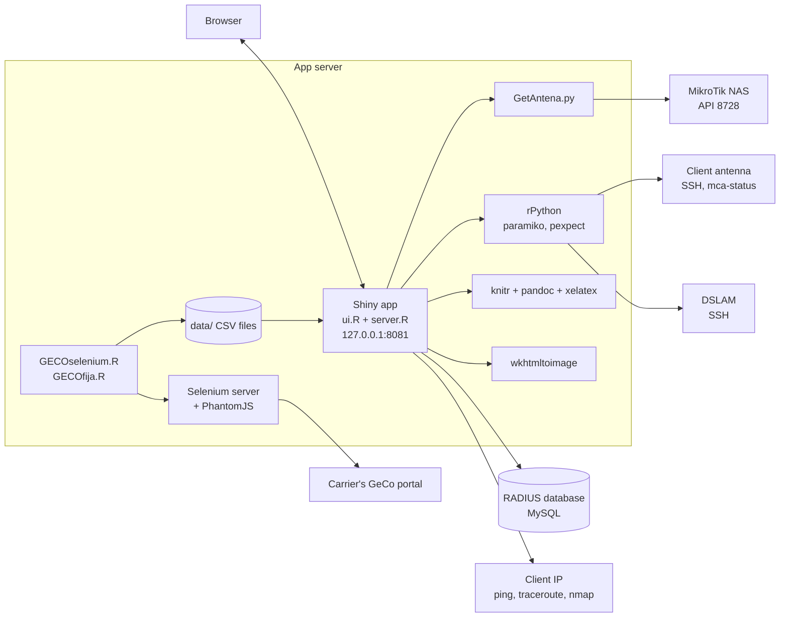

# How it works

## The parts

- `ui.R` defines the five tabs; `server.R` answers every button. One R process serves all users.
- The app queries MySQL directly with `RMySQL` and opens and closes a connection per search.
- The antenna lookup runs `python3 GetAntena.py <nas>`, a RouterOS API client that prints the NAS's DHCP leases, and matches the lease whose host name is built from the client's user and first name.
- SSH to antennas and DSLAMs runs as Python code inside the R process through `rPython`: paramiko for the antenna, pexpect driving the `ssh` command for the DSLAM.
- Ping, traceroute and nmap run as shell commands against the client's IP from the last RADIUS session.
- The PDF is `RMD/diagnosis.rmd` rendered with `knitr::knit`, then `pandoc` with xelatex, in the `RMD/` directory.

## A client lookup, step by step

1. The PPPoE user is looked up in `rm_users`, its service name in `rm_services`, its sessions in `radacct` and its router in `nas`.
2. The last session gives the client's IP, the CPE's MAC and the NAS. No stop time means the client is online.
3. `GetAntena.py` asks that NAS for its DHCP leases. The lease whose host name is the user name without its `t` plus the first letter of the client's first name is the antenna.
4. In Diagnosis, the app then logs in to the antenna and parses the `key=value` lines `mca-status` prints.
5. Traffic is `acctoutputoctets` as download and `acctinputoctets` as upload, both seen from the NAS.

## The background jobs

The alarm lists come from two loops that run outside the app:

- `GECOselenium.R` (started by `GeCoMovil.sh`) and `GECOfija.R` start PhantomJS, connect to a Selenium server on `localhost`, log in to the carrier's GeCo portal, open the billing summary, read the table as text and keep the lines that pass the alarm rule.
- They read the table by fixed line positions in the page text, so any change to the portal's page breaks them.
- Each writes its CSV to `data/`, sleeps until 30 minutes have passed since its start, and repeats.
- `mailR.R` sends both CSVs by email when run. Scheduling it is up to you.

## Security model

The app was an internal tool, reachable only from inside the ISP's network. It has no protection of its own:

- There is no login. Anyone who can load the page can use every tab, including the one that changes the DSLAM.
- Form input is not escaped. It goes into SQL queries, into shell commands, and into Python source that is then typed into the DSLAM's command line. Someone who can reach the page can run commands on the server and on the DSLAM.
- Host keys are not checked on SSH to antennas and DSLAMs.
- The shipped database user is `root`. Use a read-only user.
- The passwords live in the code.

`AtBoot.sh` listens on `127.0.0.1` only. Keep it that way. If people need it from other machines, put it behind a reverse proxy that requires a login, on a network only staff can reach.
